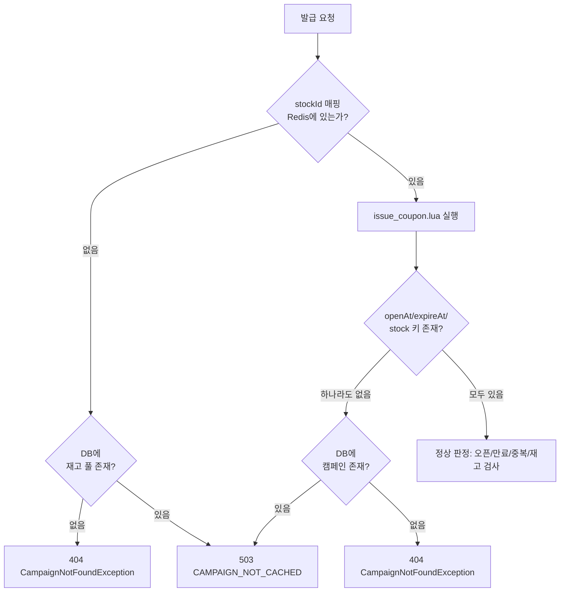
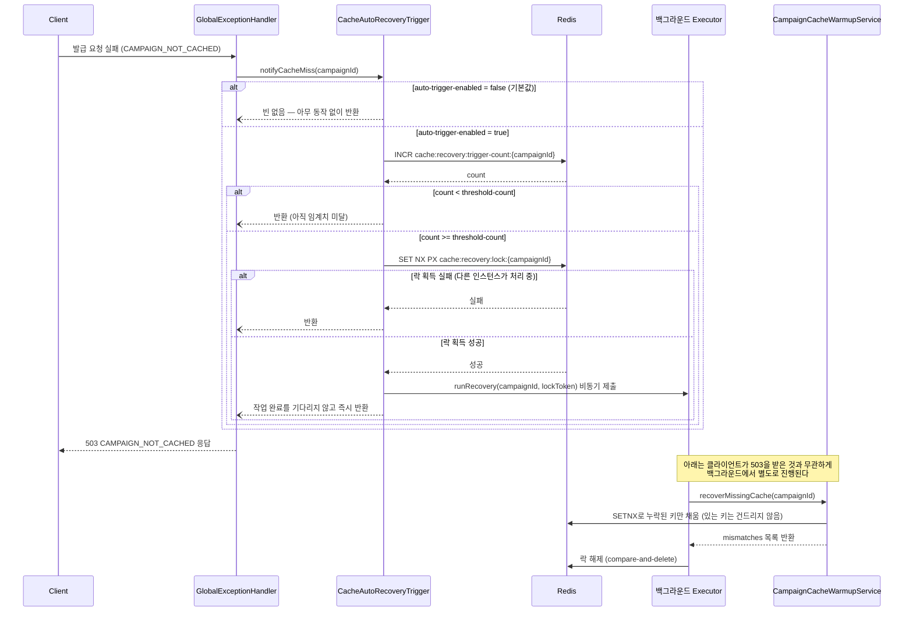
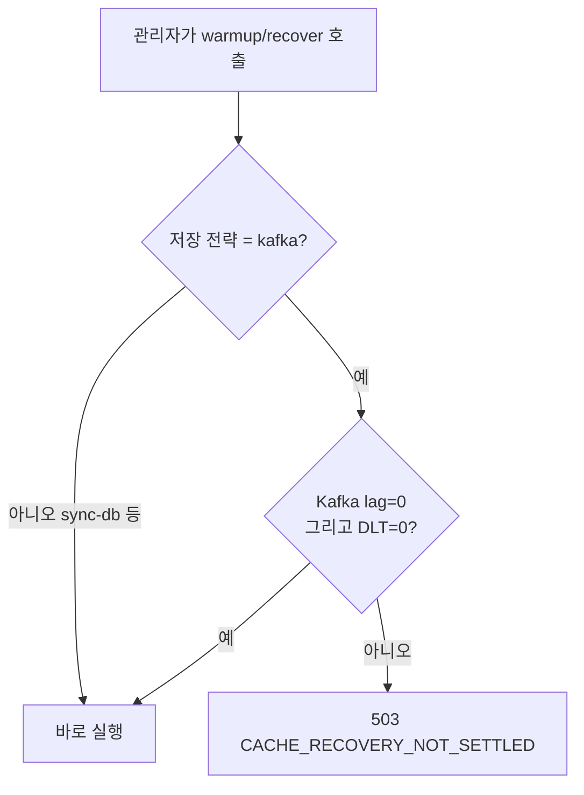

# Redis 캐시 미스(CAMPAIGN_NOT_CACHED) 대응 절차

## 1. 문서 목적

이 문서는 발급 요청 처리 중 Redis에 캠페인 캐시(`openAt`/`expireAt`/`stock:{stockId}`)가
없어서 `CAMPAIGN_NOT_CACHED`가 발생했을 때, 시스템이 자동으로 무엇을 하고 운영자가
무엇을 확인·대응해야 하는지 정의한다.

Kafka 쪽 장애([`kafka-dlt-manual-response.md`](kafka-dlt-manual-response.md),
[`kafka-pending-manual-response.md`](kafka-pending-manual-response.md))와 달리 이 흐름은
**자동 복구 옵션을 갖고 있다.** 기본은 비활성화이며, 켜도 로그·지표 기반 판단으로
동작하는 조건부 자동화다. 완전 자동은 아니다.

범위: 이 문서는 **발급 요청 경로**(`LuaScriptIssueStrategy`, `RedisStockIdLookup`)에서
발생하는 `CAMPAIGN_NOT_CACHED`(503)만 다룬다. `GET /api/campaigns/{campaignId}` 등 캠페인
조회 API가 캐시 누락 시 반환하는 500 오류는 README "6. 캠페인 조회 API 사용 전 준비"에
별도로 문서화되어 있으며 이 문서의 범위가 아니다.

## 2. 발생 조건

Redis Lua 스크립트(`issue_coupon.lua`)는 웜업 데이터가 없으면 `-3`을 반환한다.

| 확인 대상 | 스크립트 위치 | 반환값 |
| --- | --- | --- |
| `campaign:{campaignId}:openAt` 없음 | `issue_coupon.lua:25-28` | `-3` |
| `campaign:{campaignId}:expireAt` 없음 | `issue_coupon.lua:37-40` | `-3` |
| `stock:{stockId}` 없음 | `issue_coupon.lua:53-57` | `-3` |

stockId 조회 단계(`RedisStockIdLookup.lookupStockId`)에서도 `stockId:{campaignId}:{routeId}:{fareClass}`
매핑 키가 없으면 별도로 `CAMPAIGN_NOT_CACHED`를 던진다(`RedisStockIdLookup.java:33-38`).

**두 경로 모두 DB에 해당 캠페인/재고 풀이 실제로 존재하는지 재확인한 뒤에만
`CAMPAIGN_NOT_CACHED`로 확정한다** — DB에도 없으면 `CampaignNotFoundException`(404)으로
바뀐다(`LuaScriptIssueStrategy.java:86-91`, `RedisStockIdLookup.java:35-40`). "캠페인이
아예 없는 것"과 "웜업만 누락된 것"을 이렇게 구분한다.



## 3. 감지 시 자동 대응 흐름

`GlobalExceptionHandler`는 `CAMPAIGN_NOT_CACHED`를 503으로 응답하기 직전에
`notifyCacheMiss(campaignId)`를 호출한다(`GlobalExceptionHandler.java:87-93,255-260`). 이
호출은 `CacheAutoRecoveryTrigger` 빈이 있을 때만(=자동 트리거가 켜져 있을 때만) 실제로
동작하며, 없으면 조용히 건너뛴다.

이 흐름은 여러 컴포넌트가 시간 순서대로 상호작용하고, 특히 "클라이언트 응답"과
"백그라운드 복구 실행"이 서로 기다리지 않고 갈라진다는 점이 핵심이라 결정 트리보다
시퀀스 다이어그램이 더 명확하다.



핵심 설계 포인트:

- **요청 스레드를 블로킹하지 않는다.** 임계치 판정과 락 획득까지만 동기로 하고, 실제
  복구(`recoverMissingCache`)는 별도 executor로 넘긴다 — 503 응답 자체가 지연되지 않는다
  (`CacheAutoRecoveryTrigger.java:77-81`).
- **여러 API 서버 인스턴스에도 안전하다.** 카운트는 Redis `INCR`로 전체 인스턴스 합산
  판정되고, 실제 복구 실행은 분산 락으로 한 인스턴스만 수행한다.
- **이 판정 로직 자체의 실패가 503 응답에 영향을 주지 않는다.** `onCacheMiss`는
  내부 예외를 전부 삼킨다(`CacheAutoRecoveryTrigger.java:123-125`).

## 4. 설정값

| 키 (application.yml) | 환경 변수 | 기본값 | 의미 |
| --- | --- | --- | --- |
| `coupon.cache-recovery.auto-trigger-enabled` | `CACHE_RECOVERY_AUTO_TRIGGER_ENABLED` | `false` | 자동 트리거 전체 스위치 |
| `coupon.cache-recovery.threshold-count` | `CACHE_RECOVERY_THRESHOLD_COUNT` | `5` | 윈도우 내 몇 회 미스부터 복구를 트리거할지 |
| `coupon.cache-recovery.window-seconds` | `CACHE_RECOVERY_WINDOW_SECONDS` | `5` | 미스 카운트 집계 윈도우(초) |
| `coupon.cache-recovery.lock-seconds` | `CACHE_RECOVERY_LOCK_SECONDS` | `30` | 복구 중복 실행 방지 락 TTL(초) |

기본은 비활성화다. `application.yml` 주석에 명시된 대로, 수동 관리자 API(5장)로 충분히
검증한 뒤 팀 합의로 켜는 것을 전제로 설계됐다.

## 5. warmup vs recover — 두 관리자 API의 차이

`CampaignCacheAdminController`(`/api/admin/campaigns/{campaignId}/cache/...`)는 목적이
다른 두 엔드포인트를 제공한다.

| | `POST .../cache/warmup` | `POST .../cache/recover` |
| --- | --- | --- |
| 대상 | 오픈 전 사전 적재, 또는 발급 트래픽을 확실히 차단한 뒤 전체 재구축 | 운영 중 Redis 키 일부 유실 시 부분 복구 |
| 살아있는 키 | DB 스냅샷으로 **무조건 덮어씀** | **절대 덮어쓰지 않음** (SETNX만 사용) |
| 트래픽 차단 필요 | 필요 | 불필요 |
| `CAMPAIGN_NOT_CACHED` 발생 시 쓸 것 | ✗ (실시간 감소 중인 재고가 되살아나 초과 발급 위험) | ✓ |

`recover`는 자체 안전장치도 갖고 있다: SETNX로 누락된 키만 채운 뒤,
방금 복구한 재고 풀에 한해 `redis > db`(재고가 DB보다 많이 남은 것처럼 되돌아간 경우)만
위험 신호로 보고한다(`CampaignCacheWarmupService.verifyRecoveredStocks`,
`CampaignCacheWarmupService.java:288-350`). 정상적인 시간차(`redis <= db`)는 보고하지
않는다 — 트래픽 차단을 전제하지 않는 API라 이 정도 시간차는 항상 존재하기 때문이다.

**두 엔드포인트 모두 저장 전략이 Kafka(V3)일 때는 실행 전에 Kafka 정착 여부를 확인한다**
(`CampaignCacheWarmupService.requireKafkaSettled`, `CampaignCacheWarmupService.java:210-224`).
lag가 남아있거나 DLT가 있으면 `CacheRecoveryNotSettledException` → 503
`CACHE_RECOVERY_NOT_SETTLED`로 거부된다 — 아직 DB에 반영되지 않은 발급분이 있는 상태에서
DB를 정답으로 캐시를 되돌리면, 그 발급분의 유저가 `issued:{campaignId}` Set에서
사라져 재발급이 가능해지고 재고도 그만큼 부풀려 복구되기 때문이다.



## 6. 수동 대응 절차 (자동 복구가 꺼져 있거나, 켜져 있어도 해소되지 않을 때)

1. 503 `CAMPAIGN_NOT_CACHED` 발생 빈도를 확인한다. 반복 재현되면 특정 캠페인의 웜업
   누락일 가능성이 높다.
2. Redis에서 직접 확인한다.

   ```powershell
   docker exec coupon-redis redis-cli GET "campaign:{campaignId}:openAt"
   docker exec coupon-redis redis-cli GET "campaign:{campaignId}:expireAt"
   docker exec coupon-redis redis-cli GET "stock:{stockId}"
   ```

3. **트래픽이 아직 없는 캠페인**(오픈 전, 또는 시연 직전 재확인)이라면 전체 재구축을
   쓴다.

   ```powershell
   curl -X POST http://localhost:8080/api/admin/campaigns/{campaignId}/cache/warmup
   ```

4. **이미 발급이 진행 중인 캠페인**에서 키 일부만 유실됐다면 부분 복구를 쓴다. `warmup`을
   쓰면 안 된다(3절 표 참고).

   ```powershell
   curl -X POST http://localhost:8080/api/admin/campaigns/{campaignId}/cache/recover
   ```

5. `recover` 응답의 `mismatches` 목록이 비어 있지 않으면, `redis > db`로 보고된 재고
   풀은 초과 발급 위험 신호다. 즉시 수정하지 말고 원인(어느 경로로 Redis 값이
   부풀려졌는지)을 먼저 조사한다.
6. 저장 전략이 kafka(V3)인데 503 `CACHE_RECOVERY_NOT_SETTLED`가 나오면, 먼저
   Kafka Consumer lag과 DLT를 확인한다(절차는
   [`kafka-dlt-manual-response.md`](kafka-dlt-manual-response.md) 5장 참고). 정착되기
   전에는 `warmup`/`recover` 모두 실행할 수 없다.

## 7. 금지 사항

- 발급 트래픽이 진행 중인 캠페인에 `warmup`(전체 재구축)을 호출하지 않는다 — 실시간으로
  감소 중인 `stock:{stockId}`가 DB 스냅샷 값으로 되돌아가 초과 발급으로 이어질 수 있다.
- Kafka 저장 전략(V3)에서 `CACHE_RECOVERY_NOT_SETTLED` 거부를 우회하려고 강제로 재시도
  간격을 줄이거나 검사를 건너뛰지 않는다.
- `recover` 응답에 `redis > db` 위험 신호가 있는데 원인 확인 없이 바로 `warmup`으로
  덮어쓰지 않는다 — 진짜 원인(예: 이중 웜업 실행, 복구 중 레이스)을 먼저 특정한다.
- 자동 트리거(`auto-trigger-enabled`)를 켤 때 `threshold-count`/`window-seconds`를
  운영 트래픽 특성 검증 없이 임의로 낮추지 않는다 — 너무 민감하면 정상적인 웜업 지연 중에도
  불필요한 전체 캠페인 복구가 반복 실행될 수 있다.

## 8. 완료 조건

- [ ] 반복되는 `CAMPAIGN_NOT_CACHED`의 원인(웜업 누락 vs 진짜 캐시 유실)을 구분했다.
- [ ] 트래픽 상태에 맞는 엔드포인트(`warmup` vs `recover`)를 선택해 실행했다.
- [ ] `recover` 실행 시 `mismatches`가 비어 있거나, 비어 있지 않다면 원인을 조사·기록했다.
- [ ] Kafka 저장 전략(V3)이면 `CACHE_RECOVERY_NOT_SETTLED` 없이 정상 완료됐다.
- [ ] 복구 후 재현 요청으로 정상 발급이 되는지 확인했다.
