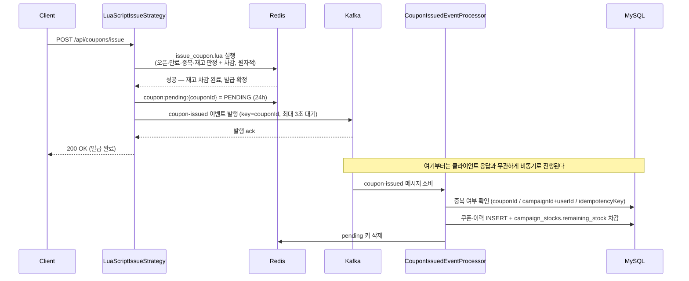

# V3 발급·저장 흐름 (Redis Lua + Kafka 비동기)

**한 줄 요약**: 재고 차감·중복 방지는 Redis Lua가 요청 시점에 동기로 확정하고, MySQL
반영은 Kafka를 통해 비동기로 나중에 이루어진다.

## 전체 흐름

핵심은 **"재고 선점은 요청 시점에 끝나고, DB 기록은 나중에 끝난다"**는 것이다. 클라이언트가
200을 받은 순간에도 MySQL에는 아직 그 쿠폰이 없을 수 있다.

## 각 단계

1. **Redis Lua 판정**(`issue_coupon.lua`) — 오픈·만료·중복·재고를 한 번의 원자 연산으로
   판정하고 차감까지 끝낸다. 여기서 성공하면 그 유저의 재고는 일단 선점된다.
2. **pending 키 기록** — Kafka 발행 전에 `coupon:pending:{couponId}`를 먼저 남긴다. 이후
   저장·발행이 **확실히 실패**하고 보상까지 성공하면 Redis 재고와 발급 Set을 원복하고
   pending 키도 지운다. 반대로 발행 결과가 **불확실**하면(타임아웃 등) 초과 발급을 막기
   위해 원복하지 않고 pending 키를 유지한다 — 갈라지는 조건은 아래 표를 참고.
3. **Kafka 발행**(`CouponIssuedProducer`) — `couponId`를 파티션 키로 최대 3초 동기
   발행한다. 성공하면 클라이언트에 즉시 200을 응답한다.
4. **Consumer 소비**(`CouponIssuedEventProcessor`) — 메시지를 받으면 먼저 중복인지
   확인하고, 아니면 쿠폰·이력을 저장하고 DB 재고를 차감한 뒤 pending 키를 지운다.

## 정상 흐름이 갈라지는 지점

정상 흐름 도중에도 아래 세 지점에서 실패·불확실 분기가 생길 수 있다. 각 분기의 대응
절차는 별도 문서에 있다 — 이 문서는 정상 흐름만 다룬다.

| 분기 지점 | 무엇이 갈라지는가 | 자세한 대응 |
| --- | --- | --- |
| Redis Lua 실행 전 | 웜업 데이터(`openAt`/`expireAt`/`stock:{stockId}`)가 없음 | [redis-cache-miss-response.md](redis-cache-miss-response.md) |
| Kafka 발행 결과 | 확실한 실패는 즉시 Redis 자동 롤백, 결과 불명확이면 pending 유지 | [kafka-pending-manual-response.md](kafka-pending-manual-response.md) |
| Consumer 처리 | 저장이 재시도 3회에도 계속 실패하면 DLT로 격리 | [kafka-dlt-manual-response.md](kafka-dlt-manual-response.md) |
